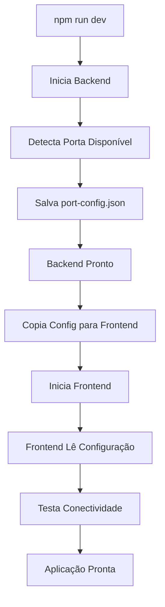

# 🔧 Sistema de Configuração Automática de Portas

Este documento detalha como o sistema de detecção automática de portas funciona no MyToDo App, resolvendo problemas de conflitos de porta que podem ocorrer dependendo do momento em que a aplicação é iniciada.

## 🎯 Problema Resolvido

**Antes:** Conflitos de porta causavam erros como:
- ❌ `Error: listen EADDRINUSE: address already in use :::3001`
- ❌ `net::ERR_FAILED` no frontend
- ❌ `TypeError: Failed to fetch` ao carregar dados

**Depois:** Sistema robusto que:
- ✅ Detecta automaticamente portas disponíveis
- ✅ Coordena inicialização backend → frontend
- ✅ Configura comunicação automaticamente
- ✅ Fornece fallbacks inteligentes

## 🏗️ Arquitetura da Solução

### 1. Backend - Detecção Automática de Portas

**Arquivo:** `backend/src/utils/portUtils.ts`

```typescript
// Funcionalidades principais:
- isPortAvailable(port): Verifica se uma porta está livre
- findAvailablePort(startPort): Encontra próxima porta disponível
- getBackendPort(): Obtém porta para o backend (com fallback)
- saveBackendPort(port): Salva configuração para o frontend
```

**Fluxo:**
1. Tenta usar porta configurada em `process.env.PORT` (padrão: 3001)
2. Se ocupada, testa 3002, 3003, 3004... até encontrar livre
3. Salva configuração em `port-config.json` na raiz do projeto
4. Inicia servidor na porta encontrada

### 2. Frontend - Configuração Dinâmica

**Arquivo:** `frontend/src/utils/portUtils.ts`

```typescript
// Funcionalidades principais:
- getApiBaseUrl(): Lê configuração dinâmica ou usa fallback
- testApiConnectivity(url): Testa se API está acessível
- findWorkingApiUrl(): Testa múltiplas URLs até encontrar funcional
```

**Fluxo:**
1. Tenta ler `port-config.json` (gerado pelo backend)
2. Se não encontrar, usa `VITE_API_URL` do `.env`
3. Se não encontrar, usa fallback `http://localhost:3001/api`
4. Testa conectividade e usa primeira URL funcional

### 3. Script de Inicialização Coordenada

**Arquivo:** `scripts/start-dev.js`

```javascript
// Funcionalidades principais:
- startBackend(): Inicia backend e aguarda estar pronto
- startFrontend(): Inicia frontend após backend estar pronto
- Copia configuração de porta para frontend/public/
- Logs organizados com cores para cada serviço
- Shutdown graceful com Ctrl+C
```

**Fluxo:**
1. **Inicia Backend:** Executa `npm run dev` no diretório backend
2. **Aguarda Pronto:** Monitora logs até ver "Servidor rodando na porta"
3. **Lê Configuração:** Carrega `port-config.json` gerado pelo backend
4. **Copia Config:** Coloca arquivo em `frontend/public/` para acesso via HTTP
5. **Inicia Frontend:** Executa `npm run dev` no diretório frontend
6. **Monitora Ambos:** Mantém ambos rodando e organiza logs

## 📁 Arquivos de Configuração

### `port-config.json` (Raiz do Projeto)
```json
{
  \"backend\": 3001,
  \"timestamp\": \"2024-01-15T10:30:00.000Z\",
  \"baseUrl\": \"http://localhost:3001\"
}
```

### `frontend/public/port-config.json` (Copiado pelo Script)
```json
{
  \"backend\": 3001,
  \"timestamp\": \"2024-01-15T10:30:00.000Z\",
  \"baseUrl\": \"http://localhost:3001\"
}
```

## 🚀 Como Usar

### Modo Recomendado (Coordenado)
```bash
npm run dev
```
- Inicia backend primeiro, depois frontend
- Configuração automática
- Logs organizados
- Shutdown com Ctrl+C

### Modo Separado (Legado)
```bash
# Terminal 1
npm run dev:backend

# Terminal 2  
npm run dev:frontend
```

### Modo Antigo (Sem Detecção)
```bash
npm run dev:old
```

## 🔍 Troubleshooting

### Problema: Frontend não conecta ao backend
**Solução:**
1. Verifique se `port-config.json` existe na raiz
2. Verifique se `frontend/public/port-config.json` existe
3. Use modo coordenado: `npm run dev`

### Problema: Porta ainda em conflito
**Solução:**
1. O sistema tenta até 10 portas sequenciais
2. Se todas estiverem ocupadas, aumentar `MAX_ATTEMPTS` em `portUtils.ts`
3. Verificar processos rodando: `netstat -ano | findstr :3001`

### Problema: API não responde
**Solução:**
1. Sistema testa múltiplas URLs automaticamente
2. Verifica logs do backend para erros
3. Testa conectividade manualmente: `curl http://localhost:3001/health`

## 🎛️ Configurações Avançadas

### Personalizar Portas Padrão
```typescript
// backend/src/utils/portUtils.ts
export const DEFAULT_PORTS = {
  BACKEND: 3001,        // Alterar aqui
  FRONTEND: 3004,       // Alterar aqui  
  MAX_ATTEMPTS: 10      // Alterar aqui
} as const;
```

### Personalizar URLs de Fallback
```typescript
// frontend/src/utils/portUtils.ts
const candidates = [
  await getApiBaseUrl(),
  'http://localhost:3001/api',  // Alterar aqui
  'http://localhost:3002/api',  // Adicionar mais aqui
  'http://localhost:3003/api'   // Adicionar mais aqui
];
```

## 📊 Benefícios da Implementação

1. **Robustez:** Elimina conflitos de porta
2. **Automação:** Zero configuração manual necessária
3. **Flexibilidade:** Funciona em qualquer ambiente
4. **Debugging:** Logs claros e organizados
5. **Manutenibilidade:** Código bem estruturado e documentado
6. **Experiência:** Inicialização suave e confiável

## 🔄 Fluxo Completo de Inicialização



Este sistema garante que a aplicação sempre inicie corretamente, independentemente de quais portas estejam disponíveis no momento da execução.